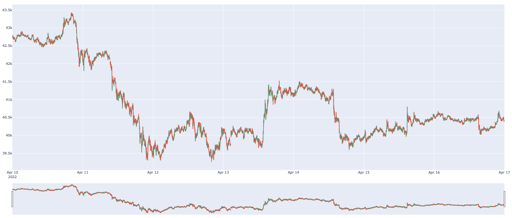

# Scrooge McDuck
Scrooge McDuck is a financial extension to [DuckDB](https://www.duckdb.org).
The main goal of this extension is to support a set of aggregation functions and data scanners frequently used on financial data.


To build, type 
```
make
```

To run, run the bundled `duckdb` shell:
```
 ./duckdb/build/release/duckdb 
```

Then, load the Scrooge McDuck extension like so:
```SQL
LOAD 'build/release/scrooge.duckdb_extension';
```

## Demo
To reproduce this demo, you must have:
1. A build of Scrooge McDuck.
2. The latest python libraries of DuckDB and Plotly ``` pip install duckdb plotly```
3. Download and unzip the example [dataset.](https://github.com/pdet/Scrooge-McDuck/raw/main/crypto_sample.zip)

To start, we need to load the libraries we will be using in this tutorial.
```python
import duckdb
import plotly.graph_objects as go
```

### Loading Scrooge McDuck
To load Scrooge McDuck, we simply have to execute the ```LOAD``` command together with the compiled path of the library.
```python
con = duckdb.connect()
con.execute("LOAD 'build/release/scrooge.duckdb_extension';")
```
### Creating Table
We only have one table in our dataset, the crypto_ticks, that holds the price (to USD) of a cryptocurrency at a given time.
```python
con.execute("""CREATE TABLE crypto_ticks (
               "time" TIMESTAMP,
               symbol TEXT,
               price DOUBLE PRECISION,
               day_volume NUMERIC
            );""")
```

### Loading Data
Our dataset is a CSV file; hence to load it we simply need a ```COPY ... FROM... ``` statement.
```python
con.execute("COPY crypto_ticks FROM 'tutorial_sample_tick.csv' CSV HEADER;")
```

### Generating Candle-Stick Aggregations
Here we generate our main aggregation using the domain-specific functions from Scrooge McDuck. To generate these aggregations, we must take, from within our time bucket, the open and close values of a cryptocurrency and their high and low values. In this case, we focus only on the week from 10-17 of April 22.
Since DuckDB has a tight integration with Pandas, to facilitate plotting we export our query result to a Pandas Dataframe with the ```.df()``` function.
```python
df = con.execute("""SELECT TIMEBUCKET(time,'1M'::INTERVAL) AS bucket,
                           FIRST_S(price, time) AS "open",
                           MAX(price) AS high,
                           MIN(price) AS low,
                           LAST_S(price, time) AS "close",
                    FROM crypto_ticks
                    WHERE symbol = 'BTC/USD'
                    AND time >= '2022-04-10'::TIMESTAMPTZ
                    AND time <= '2022-04-17'::TIMESTAMPTZ
                    GROUP BY bucket""").df()
```
### Plotting
To plot, we use the Candlestick aggregation of Plotly on our generated dataframe.
```python

fig = go.Figure(data=[go.Candlestick(x=df['bucket'],
                open=df['open'],
                high=df['high'],
                low=df['low'],
                close=df['close'])])
fig.show()

```
The result of our Candle-Stick aggregation can be seen below:

